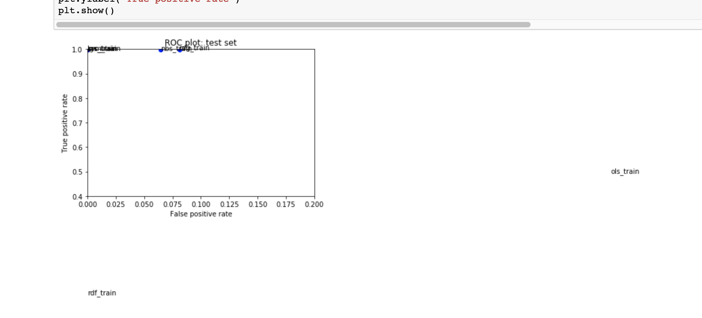
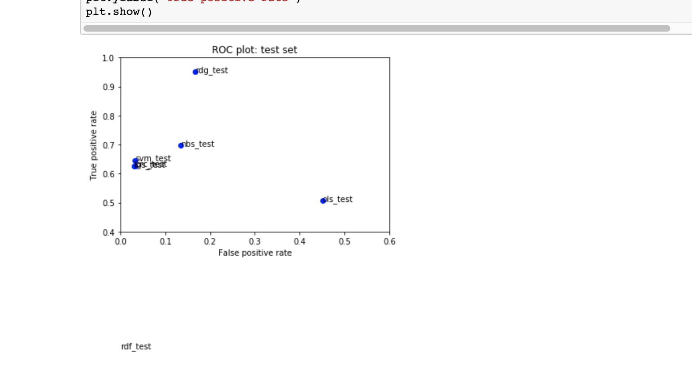
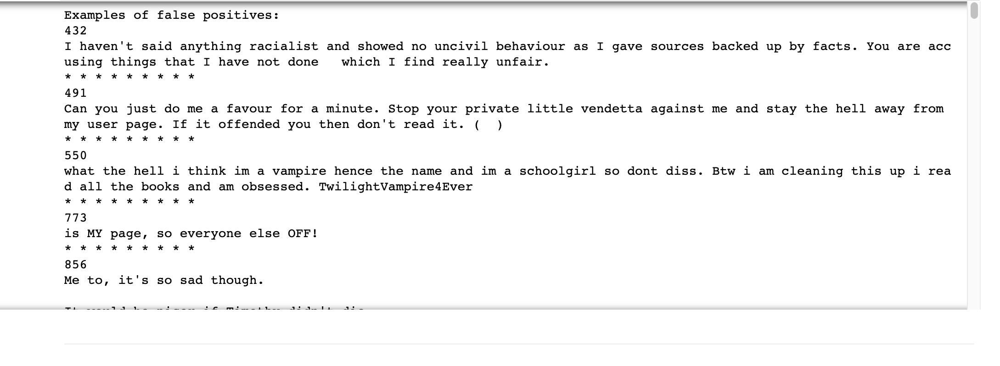

#  Assignment 1: Classification, natural language

### Machine Learning, PSAM 5020, Spring 2020 

### 0. Topic: Predicting toxic comments from amazon dataset

### 1. Problem: Overfitting

Generally, the model seems already overfitting. I was shocked at the crunch of dots at the top left corner. And hesitated if i should choose some model that has large space to improve. When looking at the test set, the result do seems the normal. In the case of overfittting, it's important that we didn't look at the test dataset too often. So I extract some more features. and adjusted the the models a bit. The main question for me is that if i should keep high false positive rate for including more instances as toxic.

### 2. Solution

#### 2.1 add more features
inspired by Marisa's solution. I also added some new features into the model including question mark and exclamation points. People tend to use those marks to show their fluctuated emotions especially when showing their compalains.

``` python
toxic_data['qs'] = len(re.findall('(\?){3,}', str(toxic_data['comment_text'])))
    toxic_data['shout'] = len(re.findall('(\!){3,}', str(toxic_data['comment_text'])))
    X_quant_features = toxic_data[["word_count", "uppercase", "qs", "shout"]]
    print("Look at a few rows of the new quantitative features: ")
    print(X_quant_features.head(50))

```

#### 2.2 use countVectorizer: ngram range,1,2 or up to 7
[count vectorizer](https://scikit-learn.org/stable/modules/generated/sklearn.feature_extraction.text.CountVectorizer.html) 
by using different combimations of ngrams. look at a single word sometimes doesn't make that much sense, just like we cannot look at "new york" seperatly when it refers to the city. So i tried different combinations such as 1 word, 2 words and up to 7 words. 

``` python
if (not test): 
        # cv_fit_transform() version 0
        cv = CountVectorizer(analyzer='word', ngram_range=(1, 1), max_features=100000)
        X_cv = cv.fit_transform(toxic_data.comment_text)
        fitted_transformations.append(cv)
        print("Shape of CountVectorizer X0:")
        print(X_cv.shape)
    else: # transform() 
        X_cv = fitted_transformations[0].transform(toxic_data.comment_text)
        print("Shape of CountVectorizer X0:")
        print(X_cv.shape) 
    
    if (not test):
        # cv_fit_transform() version 1
        cv1 = CountVectorizer(analyzer='word', ngram_range=(2, 2), max_features=100000)
        X_cv1 = cv1.fit_transform(toxic_data.comment_text)
        fitted_transformations.append(cv1)
        print("Shape of CountVectorizer X1:")
        print(X_cv1.shape) 
    else:
        X_cv1 = fitted_transformations[1].transform(toxic_data.comment_text)
        print("Shape of CountVectorizer X1:")
        print(X_cv1.shape)
    if (not test):
        # cv_fit_transform() version 2
        cv2 = CountVectorizer(analyzer='word', ngram_range=(3, 7), max_features=100000)
        X_cv2 = cv2.fit_transform(toxic_data.comment_text)
        fitted_transformations.append(cv2)
        print("Shape of CountVectorizer X2:")
        print(X_cv2.shape) 
    else:
        X_cv2 = fitted_transformations[2].transform(toxic_data.comment_text)
        print("Shape of CountVectorizer X2:")
        print(X_cv2.shape) 
    
```
#### 2.3 change settings for hashingvectorizer
I changed the n_features into "2**19", the result did not improve much here
```python
if (not test):
        # hv_fit_transform()    
        hv = HashingVectorizer(n_features=2 ** 19, alternate_sign=False)
        X_hv = hv.fit_transform(toxic_data.comment_text)
        fitted_transformations.append(hv)
        print("Shape of HashingVectorizer X:")
        print(X_hv.shape)
    else:
        X_hv = fitted_transformations[3].transform(toxic_data.comment_text)
        print("Shape of HashingVectorizer X:")
        print(X_hv.shape)
```
### 3. choose between rgd and logistic regression

From the training set, the performances of logistic regression seems better. 
result for logistic regression:
train:
```
{'Pos': 12937, 'Neg': 114719, 'TP': 12913, 'TN': 114697, 'FP': 22, 'FN': 24, 'Accuracy': 0.9996396565770508, 'Precision': 0.998299188248937, 'Recall': 0.9981448558398393, 'desc': 'lgs_train'}
```
test:
```
{'Pos': 3288, 'Neg': 28627, 'TP': 2056, 'TN': 27745, 'FP': 882, 'FN': 1232, 'Accuracy': 0.9337615541281529, 'Precision': 0.6997957794417972, 'Recall': 0.6253041362530414, 'desc': 'lgs_test'}
```
result for rgd:
train:
```
{'Pos': 12937, 'Neg': 114719, 'TP': 12924, 'TN': 105436, 'FP': 9283, 'FN': 13, 'Accuracy': 0.9271792943535753, 'Precision': 0.5819786553789346, 'Recall': 0.9989951302465796, 'desc': 'rdg_train'}
```
test:
```
{'Pos': 3288, 'Neg': 28627, 'TP': 3125, 'TN': 23851, 'FP': 4776, 'FN': 163, 'Accuracy': 0.8452451825160583, 'Precision': 0.39551955448677384, 'Recall': 0.9504257907542579, 'desc': 'rdg_test'}
```

### 3. Selected MODEL: RGD
I changed the settings of rgd a little bit by increasing its alpha into 4
Its pretty clear that the rgd test set have the highest true positive rate, while the false positive rate are slightly high than others.

Training:



Test:




### 4. Thoughts: include some compliment word into the model
When look at one false positive examples, the instance 550 states that she read the book she was obsessed with. 

it is interesting that the word obsessed set up the tone of the sentence, regardless of the word such as hell, diss that are also in the sentense. Back to the questions from the very begining. the strategy being used here is to predict more positives which may inflate the false positive rate. 


