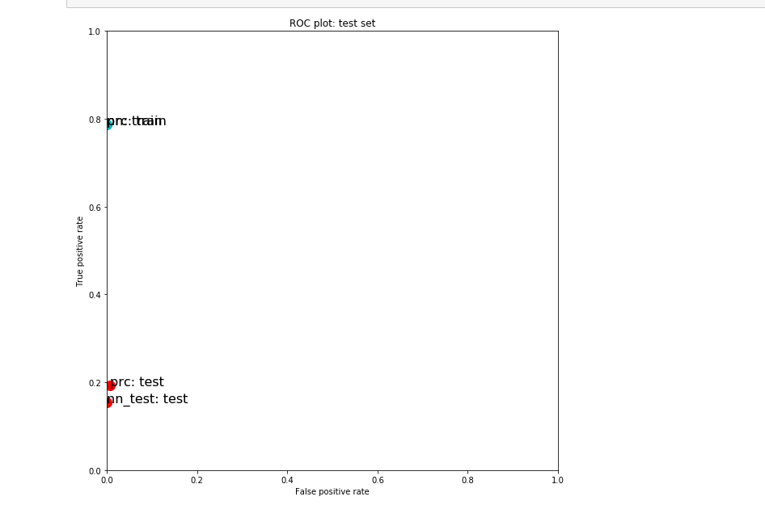
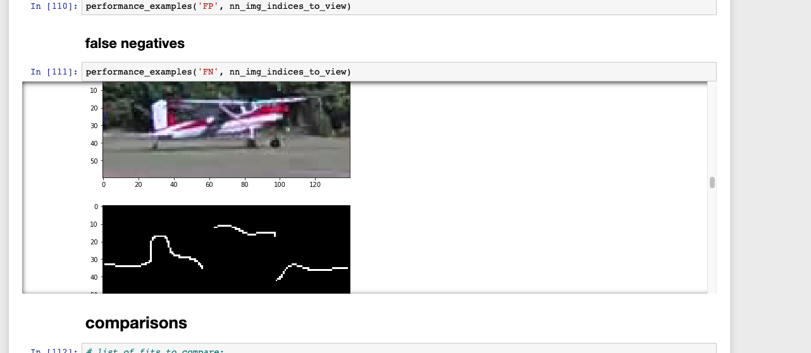

#  Assignment 2: Classification, images

### Machine Learning, PSAM 5020, Spring 2020 

### 0. Topic: Predicting plane

### 1. Problem: low accuracy rate

The final performance of this assignment is very low. Even lower than the starter code. If I keep working on that assignment, I will try to change different methods to increase the performance. Appearently, the false negative rate for my prediction is too high. I almost predict every scnene as the ones without plane. 


### 2. Solution

#### 2.1 change picture
In order to have more information of the pics, I reset the size of them into fullsize 

``` python
# in downscaling the image, what do you want the new dimensions to be?
dims = (60, 140) # 100% of the original size

```

#### 2.2 add hog feature 
Here I decided to add a hog feature[feature.hog](https://scikitimage.org/docs/dev/api/skimage.feature.html#skimage.feature.hog) 
the feature is extracted histogram of oriented gradients (HOG) for a given image.
Compute a Histogram of Oriented Gradients (HOG) by
1. (optional) global image normalization

2. computing the gradient image in row and col

3. computing gradient histograms

4. normalizing across blocks

5. flattening into a feature vecto

``` python
downscaled = transform.resize(img_raw, (dims[0], dims[1])) # downscale image
    fd, hogImage = hog(downscaled, orientations=9, pixels_per_cell=(8, 8),
                        cells_per_block=(2, 2), transform_sqrt=True, block_norm="L1",feature_vector=True,visualize=True, multichannel=False)
    #hog_image_rescaled = exposure.rescale_intensity(hog_image, in_range=(0, 10))
    hogImage = exposure.rescale_intensity(hogImage, out_range=(0, 255))
    hogImage = hogImage.astype("uint8")
    #skimage.canny
    finalImage=feature.canny(downscaled,sigma=5,use_quantiles=False)
    if imview==True:
        io.imshow(finalImage)
    warnings.filterwarnings('always')
    return finalImage
```
I choose sigma 5， orientation 9,  and block_norm equals to L1 as basic settings. Seems like with the outcome missed many details. (maybe that's due to the low resolution of the original pictures?)


#### 2.3 change max_iter and learning_rate for nn
```
from sklearn import neural_network
nn = neural_network.MLPClassifier(max_iter=2000, learning_rate='constant')
print(nn)
nn.fit(data_train, y_train)

nn_performance = BinaryClassificationPerformance(nn.predict(data_train), y_train, 'nn')
nn_performance.compute_measures()
nn_performance.performance_measures['set'] = 'train'
print('TRAINING SET: ')
print(nn_performance.performance_measures)
```

In the first version, I tried the learning_rate adaptive, I think it make more sense here, but the result seems less lower. 
constant’ is a constant learning rate given by ‘learning_rate_init’.‘adaptive’ keeps the learning rate constant to ‘learning_rate_init’ as long as training loss keeps decreasing. Each time two consecutive epochs fail to decrease training loss by at least tol, or fail to increase validation score by at least tol if ‘early_stopping’ is on, the current learning rate is divided by 5.

### 3. Selected MODEL: NN
NN performmed slightly better here 
``` python
TRAINING SET: 
{'Pos': 75, 'Neg': 4655, 'TP': 59, 'TN': 4655, 'FP': 0, 'FN': 16, 'Accuracy': 0.9966173361522199, 'Precision': 1.0, 'Recall': 0.7866666666666666, 'desc': 'nn', 'set': 'train'}
TEST SET: 
{'Pos': 26, 'Neg': 2002, 'TP': 4, 'TN': 2002, 'FP': 0, 'FN': 22, 'Accuracy': 0.9891518737672583, 'Precision': 1.0, 'Recall': 0.15384615384615385, 'desc': 'nn_test', 'set': 'test'}
```
But the plot here shows that the accracy for this adjusted version is still low.



### 4. Thoughts
appearently, the method i choose here is too rough to include every details of the picture. 

In many occasions, if the picture include any rains, or plants, or the plane is about to take off(moving, a vague figure). it will be regard as a negative one, though the plane occupied 80% of the whole image. 

