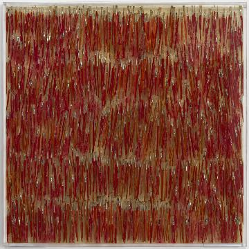
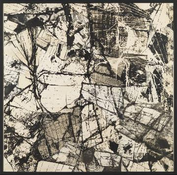
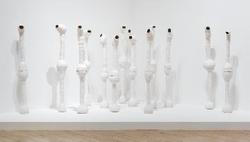
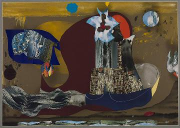

# Assignment 3: Clustering

### Machine Learning, PSAM 5020, Spring 2020 

### 0. Topic: [Option 2](https://github.com/visualizedata/ml/tree/master/ML_assignment_3/option_2)

 use [KMeans](http://scikit-learn.org/stable/modules/generated/sklearn.cluster.KMeans.html) to cluster a set of images **on their metadata.** The measure of success is subjective; you know you have chosen the right features and number of clusters when the images in each cluster "seem" like they belong together. 

### 1. Problem: Have to look at different clusters each


### 2. Solution
#### 2.1. choose features
```python
X = data[['has_text','kinetic', 'representation','representation_semi','pl','si','va', 'te', 'co', 'or','sh']]
```
including for altoghether 11 features
such as  representation, va: value. various degree bet. black & white, te: texture , co: color (hue) , or: orientation, ranging from the vertical to the horizontal direction 

#### 2.2. set up the first cluster range: 2-20
The inertia score shows that the ideal cluster exists somewhere between 2 to 20.


```python
# fit KMeans iteratively to begin to assess the appropriate number of clusters
for i in range(1, 61):
    km = KMeans(n_clusters=i)
    km.fit(X)
    distortions.append(km.inertia_)
    
# vizualize change in inertia
plt.plot(range(1, 61), distortions, marker='+')
plt.xlabel('Number of clusters')
plt.ylabel('Inertia')
plt.show()
```


### 3. Selected No. of clusters: 15
#### Reason
1. the silhouette scores is the highest among those different clusters, where a high value indicates that the object is well matched to its own cluster and poorly matched to neighboring clusters. so here only think 2 clusters, 3 clusters,6 clusters and 15 clusters.

``` result
For n_clusters = 2 The average silhouette_score is : 0.1776378536457528
For n_clusters = 3 The average silhouette_score is : 0.17696510491477993
For n_clusters = 6 The average silhouette_score is : 0.17058155313167256
For n_clusters = 9 The average silhouette_score is : 0.16412962954870933
For n_clusters = 12 The average silhouette_score is : 0.16328424886818554
For n_clusters = 15 The average silhouette_score is : 0.17246813464737407
For n_clusters = 18 The average silhouette_score is : 0.15721887693477937
For n_clusters = 21 The average silhouette_score is : 0.1658130121781565
```

2.  The silhouette plot shows that the n_clusters value of 6 seems like  bad pick for the given data due to the presence of clusters with below average silhouette scores and also due to wide fluctuations in the size of the silhouette plots. Silhouette analysis is more ambivalent in deciding between 2,3 and 15.


3. Also from the thickness of the silhouette plot the cluster size can be visualized. The silhouette plot for cluster 0 when n_clusters is equal to 2, is bigger in size owing to the grouping of the 3 sub clusters into one big cluster. However when the n_clusters is equal to 15, all the plots are more or less of similar thickness and hence are of similar sizes as can be also verified from the labelled scatter plot on the right.


### 4. Further steps:
I didn't include string feature into the cluster without further modification. If I can include information like medium, the clusters can be more informative.


### 5. some fun facts about 15 clusters:
cluster 0 : greyish clusters


cluster 1: complicated lines




cluster 2 : Jackson Pollock style


cluster 3 : blurred lines


cluster 4 : black lines



cluster 5: vertical lines



cluster 6 : black dots


cluster 7 triangles


cluster 8 black and white?



cluster 9 wooden texture(colors)


cluster 10 slightly red?


cluster 11 black with little white


cluster 12 color blocks


cluster 13 faded flower-ish stuff


cluster 14 highlight from dark series


I like the second cluster, (cluster1) which shows the features of the pictures very clearly, all completed lines tangled together. I guess the model speficy the messy-ish look as the common feature for this group


